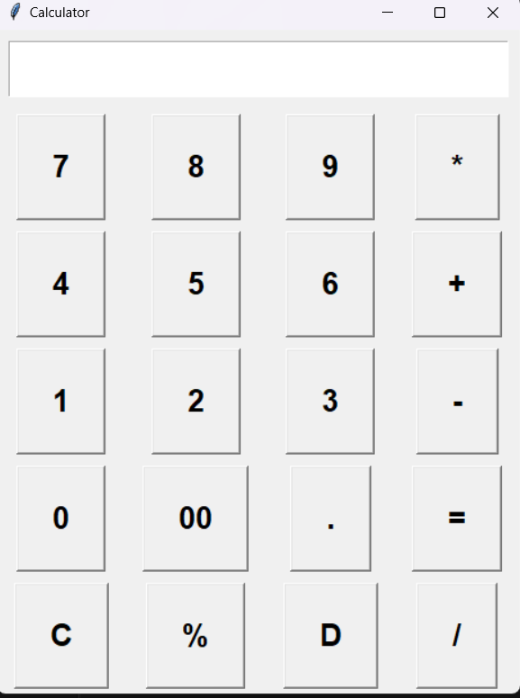

Certainly! Here's a README file for your "Calculator" project on GitHub:

# Calculator



A simple calculator application built with Python and Tkinter. This calculator provides basic arithmetic operations such as addition, subtraction, multiplication, and division. It also supports percentage calculations and allows you to clear the input and delete the last digit.

## Table of Contents

- [Features](#features)
- [Requirements](#requirements)
- [Installation](#installation)
- [Usage](#usage)
- [Contributing](#contributing)


## Features

- **User-Friendly Interface:** The application features a user-friendly GUI built with Tkinter, making it easy to perform calculations.

- **Basic Arithmetic Operations:** You can perform addition, subtraction, multiplication, and division operations using the calculator.

- **Percentage Calculation:** The calculator allows you to calculate percentages of numbers.

- **Clear and Delete:** You can clear the entire input with the "C" button and delete the last digit with the "D" button.

## Requirements

- Python 3.x
- Tkinter (usually included with Python)

## Installation

1. Clone the repository to your local machine using:

   ```bash
   git clone https://github.com/yourusername/Calculator.git
   ```

2. Change directory to the project folder:

   ```bash
   cd Calculator
   ```

3. Run the application:

   ```bash
   python main.py
   ```

## Usage

1. Launch the application using the installation instructions above.

2. The calculator interface will be displayed, featuring a text entry field at the top and a grid of buttons for numeric input and operations.

3. Click the numeric buttons to enter numbers.

4. Use the arithmetic operation buttons (+, -, *, /) to perform calculations.

5. To calculate percentages, click the "%" button.

6. Click the "C" button to clear the entire input field.

7. Click the "D" button to delete the last digit.

8. When you're ready to get the result, click the "=" button.

9. The result will be displayed in the input field.

10. You can continue performing calculations by entering new numbers and operations.

## Contributing

Contributions are welcome! If you have any suggestions, feature requests, or find any issues, please feel free to open an issue or create a pull request.


Perform calculations with ease using this calculator! 🧮
